# LocalCord

Голос, чат и демонстрация экрана для своей компании — в локальной сети или через Radmin VPN.
Как Discord, только сервер — это компьютер одного из друзей, а не чужой дата-центр.


<a href="https://github.com/Zubakamaraka/Localcord/releases/latest"></a>
<a href="https://github.com/Zubakamaraka/Localcord/releases/latest"></a>

Один установщик для всех: скачали, открыли — и через минуту уже разговариваете. С телефона — тоже.

**Страница загрузки для друзей:** https://zubakamaraka.github.io/Localcord/

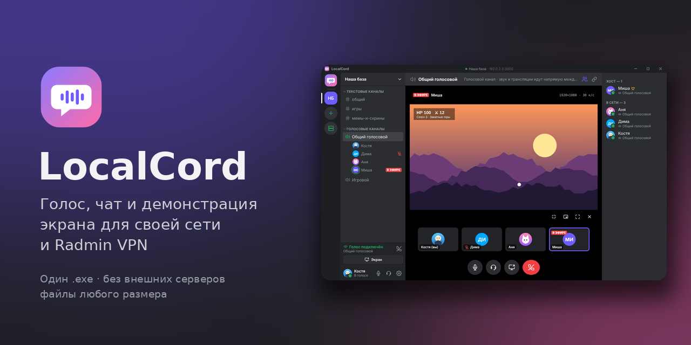

---

Проект появился из-за постоянных перебоев в Discord, особенно в общении с друзьями из России.
LocalCord работает внутри вашей сети: локальной или виртуальной, например
[Radmin VPN](https://www.radmin-vpn.com/ru/). Никаких аккаунтов, внешних серверов и блокировок —
сообщения и файлы хранятся на компьютере хоста, а голос и видео идут напрямую между участниками.

- **один .exe** — хост и друзья ставят одно и то же приложение, роль выбирается в интерфейсе
- **профиль сохраняется**: имя, цвет и фото вводятся один раз
- **автопоиск серверов** в сети — адрес вводить не обязательно
- **текстовые каналы** с историей, которая не пропадает после перезапуска
- **файлы и картинки** перетаскиванием, вставкой из буфера (Ctrl+V) или кнопкой «+»; большие файлы — потоком, без ограничений памяти
- **голосовые каналы**: шумо- и эхоподавление, индикатор «кто говорит», громкость каждого собеседника отдельно
- **демонстрация экрана** до 4K · 60 к/с, со звуком компьютера, просмотр по кнопке «Смотреть»
- **просмотр трансляции**: во весь экран (F или двойной щелчок), Esc — назад, мини-окно поверх чата, режим «поверх всех окон»
- **обновления без интернета** — их раздаёт хост
- **пароль на сервер** по желанию, пароли на компьютере хранятся в зашифрованном виде
- **7 тем оформления** (тёмные, светлые, «Полночь» для OLED), свой цвет акцента и размер интерфейса
- **версия для Android**: чат, файлы, голос и просмотр трансляций с телефона

---

## Как выглядит

| Первый запуск | Хост или гость | Подключение |
| --- | --- | --- |
| 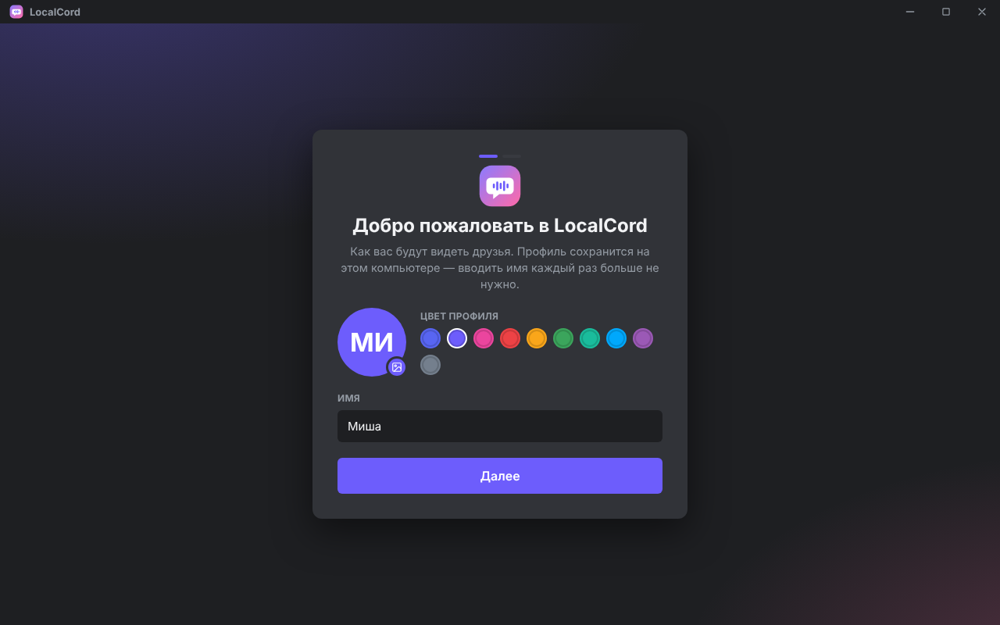 | 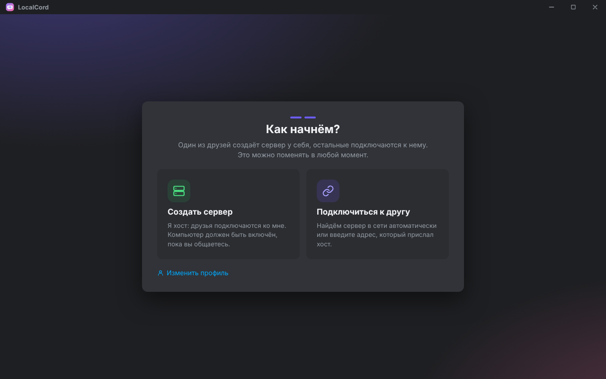 | 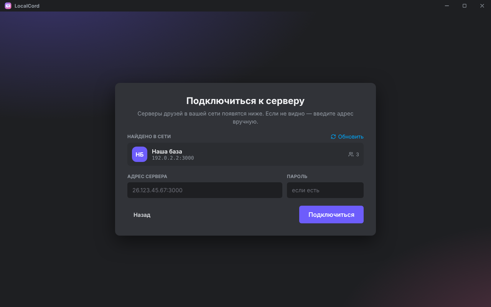 |
| Имя, цвет и фото — один раз | Создать сервер или подключиться | Серверы в сети находятся сами |

| Чат | Файлы перетаскиванием | Голосовой канал |
| --- | --- | --- |
| 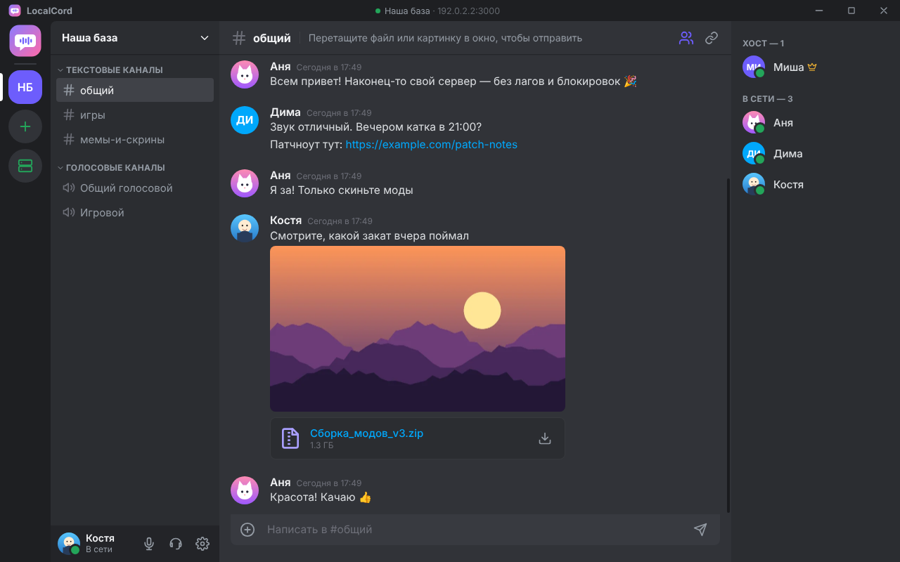 | 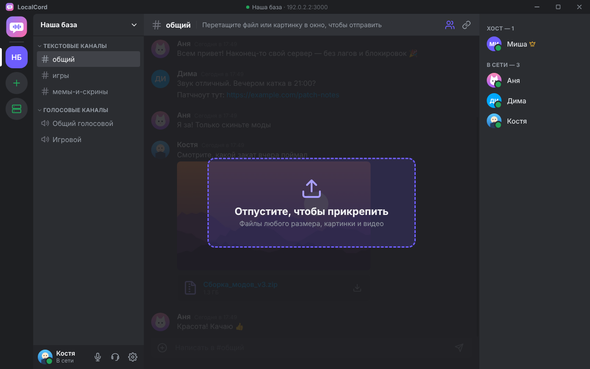 | 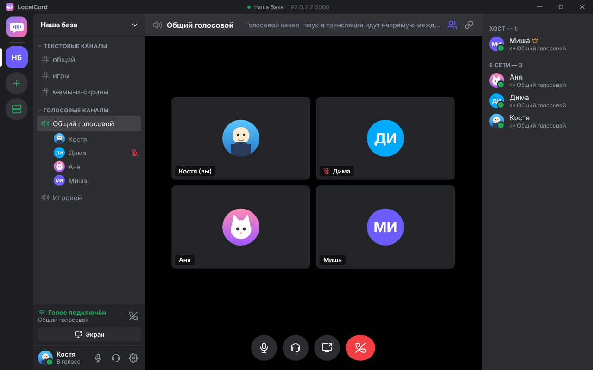 |
| Картинки, файлы, ссылки | Любой размер, несколько сразу | Кто говорит — подсвечивается |

| Выбор трансляции | Просмотр | Мини-окно |
| --- | --- | --- |
| 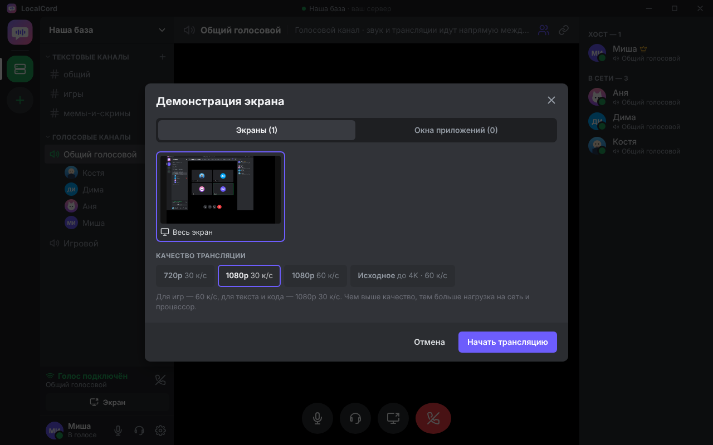 | 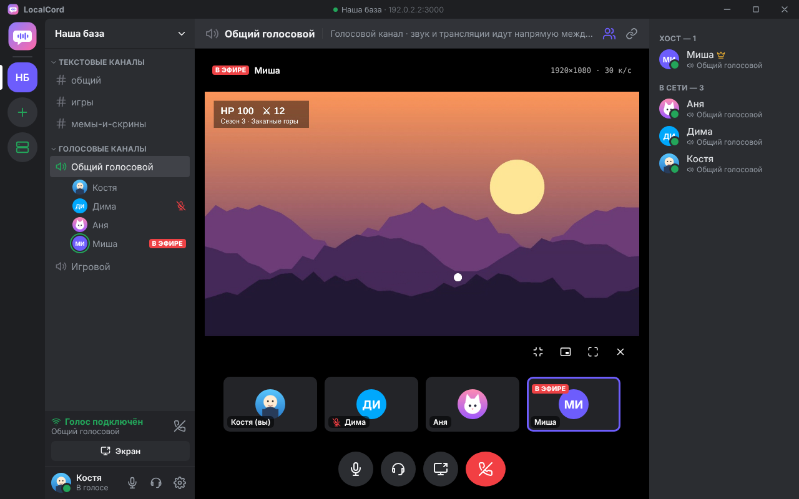 | 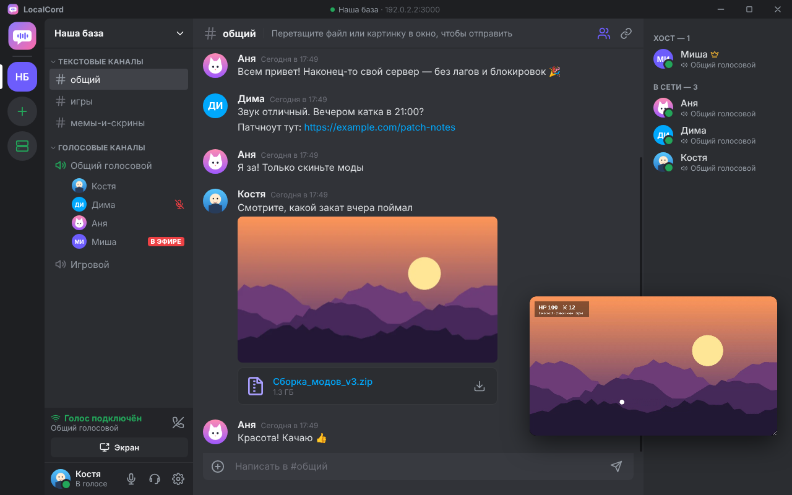 |
| Экран или окно, качество, звук | 1080p, полный экран по F | Смотреть и переписываться |

| В эфире | Пригласить друзей | Настройки сервера |
| --- | --- | --- |
| 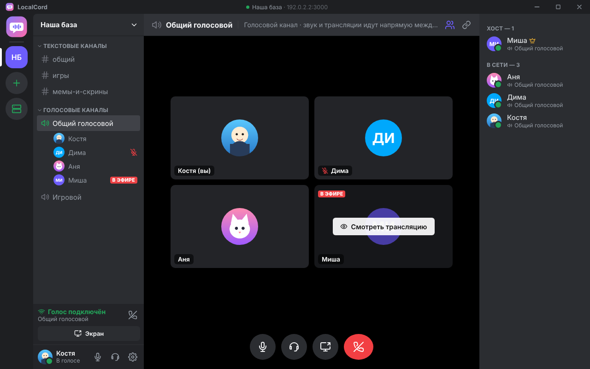 | 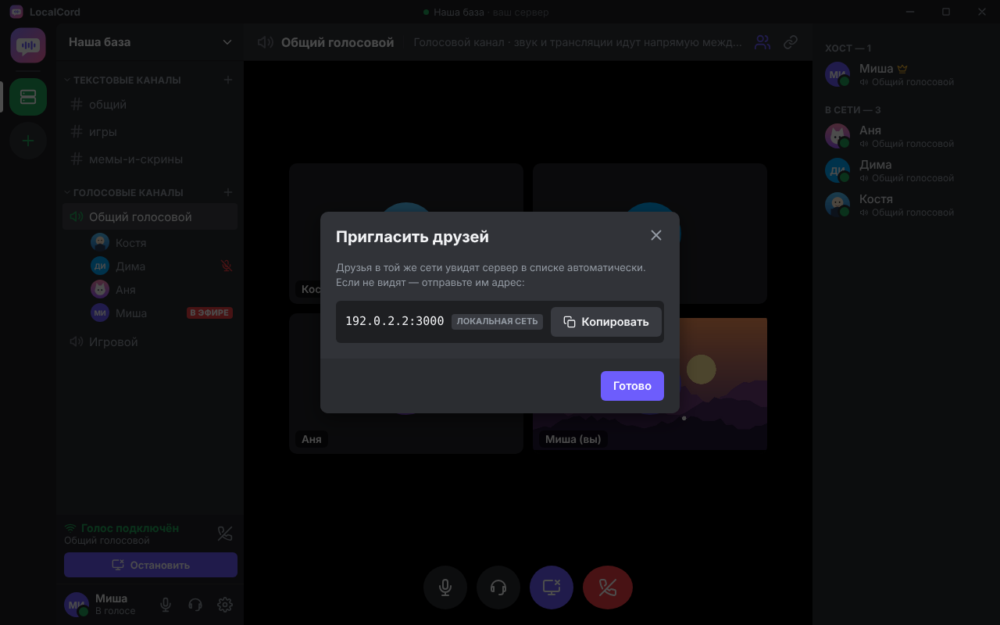 | 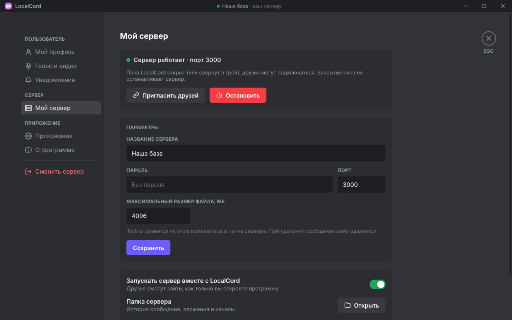 |
| Смотрит только тот, кто нажал | Адреса с кнопкой «Копировать» | Пароль, порт, лимит файлов |

### Темы оформления

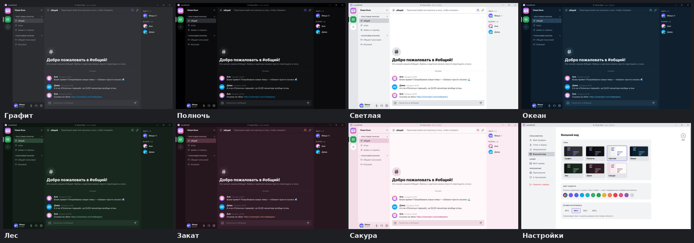

Настройки → «Внешний вид»: Графит (как в Discord), Полночь (чёрная, для OLED), Светлая, Океан, Лес,
Закат, Сакура. Любой цвет акцента — из готовых или свой, и размер интерфейса от 90 до 125 %.

### На телефоне

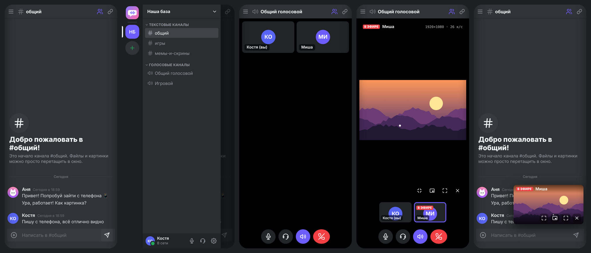

Чат, шторка каналов (свайп от левого края), голосовой канал, просмотр трансляции и мини-окно поверх чата.

---

## Требования

|              |                                                                         |
| ------------ | ----------------------------------------------------------------------- |
| Система      | Windows 10 или 11, 64 бита; телефон — Android 7 и новее                  |
| Сеть         | общая локальная сеть или [Radmin VPN](https://www.radmin-vpn.com/ru/) (Hamachi, ZeroTier и т. п. тоже подойдут) |
| Интернет     | не нужен — только общая сеть с друзьями                                 |
| Место        | около 450 МБ на диске                                                   |
| Хост         | компьютер должен быть включён, пока вы общаетесь                        |

---

## Установка

1. Скачайте **`LocalCord-Setup-x.y.z.exe`** со страницы
   [релизов](https://github.com/Zubakamaraka/Localcord/releases/latest) (или получите файл от друга).
2. Запустите. Установка занимает несколько секунд и не требует прав администратора —
   как у Discord. На рабочем столе и в меню «Пуск» появится LocalCord.
3. При первом запуске введите имя, выберите цвет и, если хотите, фото.

> Windows может показать предупреждение SmartScreen «Неизвестный издатель» — установщик
> не подписан платным сертификатом. Нажмите «Подробнее» → «Выполнить в любом случае».

### Если вы хост (сервер у вас)

1. «Создать сервер» → название, по желанию пароль → «Запустить сервер».
2. LocalCord покажет адреса для друзей (адрес Radmin VPN отмечен зелёным) — нажмите «Копировать» и отправьте.
3. Нажмите **«Разрешить»** в блоке про брандмауэр: Windows один раз спросит права администратора.
   Без этого друзья через Radmin VPN могут не подключиться — Windows считает сеть Radmin «общественной».
4. Закрытие окна не выключает сервер: LocalCord сворачивается в трей. Выйти — правой кнопкой по значку в трее.

### Если вы гость

1. «Подключиться к другу». Сервер хоста появится в списке «Найдено в сети» — нажмите на него.
2. Если списка нет — вставьте адрес, который прислал хост (например `26.123.45.67:3000`), и пароль, если он есть.
3. Дальше LocalCord подключается сам при каждом запуске.

---

## Android

Скачайте **`LocalCord-x.y.z.apk`** со страницы [релизов](https://github.com/Zubakamaraka/Localcord/releases/latest)
прямо на телефон, откройте файл и разрешите установку из этого источника.

Сервер работает только на компьютере — телефон к нему подключается. Как телефону попасть в сеть хоста:

| Где вы | Что нужно |
| --- | --- |
| Дома, в одном Wi-Fi с хостом | ничего: сервер найдётся сам в списке «Найдено в сети» |
| Не дома | общая VPN-сеть, у которой есть приложение для Android, например [ZeroTier](https://www.zerotier.com/) или [Tailscale](https://tailscale.com/). Radmin VPN работает только на Windows |

Хост может одновременно быть в Radmin VPN (для друзей с компьютерами) и, например, в ZeroTier
(для телефонов): сервер слушает все сети сразу, а в окне «Пригласить друзей» видны все его адреса.

Что умеет телефон: чат, картинки, видео и файлы (отправка из галереи и проводника, скачивание через браузер),
голосовые каналы (продолжают работать с погашенным экраном — в шторке уведомлений висит «Голос подключён»),
просмотр трансляций во весь экран и в мини-окне, переключение звука между динамиком и наушником, темы.
Показывать свой экран с телефона пока нельзя. Кнопка «Назад» закрывает окна по очереди.

---

## Демонстрация экрана

- Нажмите значок экрана внизу голосового канала → выберите экран или окно → качество.
- **720p / 1080p 30 к/с** — для текста, кода, презентаций; **60 к/с** — для игр.
- Галочка «Транслировать звук компьютера» передаёт звук игры или видео. Голоса собеседников
  тоже попадут в трансляцию, поэтому лучше использовать наушники.
- Трансляция идёт только тем, кто нажал «Смотреть», — это экономит сеть и процессор стримера.

У зрителя:

| Действие | Как |
| --- | --- |
| Во весь экран | кнопка ⛶, клавиша **F** или двойной щелчок |
| Выйти из полноэкранного режима | **Esc** |
| Свернуть в мини-окно | кнопка свернуть или ещё раз **Esc**; мини-окно можно двигать и растягивать за угол |
| Поверх всех окон | кнопка «картинка в картинке» |
| Перестать смотреть | ✕ |

Когда стример заканчивает трансляцию, окно просмотра закрывается само.

---

## Файлы и картинки

Перетащите файлы в окно чата, вставьте картинку через Ctrl+V или нажмите «+».
До 10 файлов за раз, размер ограничен только настройкой хоста (по умолчанию 4 ГБ на файл).

- Файлы передаются потоком: даже многогигабайтный архив не загружается в память целиком.
- Для больших фотографий автоматически делается уменьшенная копия для ленты чата;
  оригинал открывается по щелчку и скачивается кнопкой.
- Видео (mp4, webm) и аудио проигрываются прямо в чате.
- Скачанное сохраняется в папку «Загрузки».
- Файлы хранятся на компьютере хоста. Удалили сообщение — удалился и файл.

---

## Обновление

Обновления раздаёт хост, интернет не нужен:

1. Хост устанавливает новую версию LocalCord поверх старой (просто запускает новый установщик).
2. Друзья при подключении видят полосу «Доступна новая версия» → «Обновить» → «Установить и перезапустить».
3. Профиль, настройки, история и файлы сохраняются.

---

## Удаление

Любым из способов:

- меню «Пуск» → **«Удалить LocalCord»**;
- в самом приложении: Настройки → «Приложение» → «Удалить LocalCord»
  (там же можно отметить «удалить также профиль и историю»);
- «Параметры Windows» → «Приложения» → LocalCord → «Удалить».

---

## Безопасность и приватность

| Что | Как защищено |
| --- | --- |
| Голос и трансляции | идут напрямую между участниками и всегда шифруются (DTLS-SRTP, стандарт WebRTC) |
| Чат и файлы | хранятся только на компьютере хоста; через Radmin VPN трафик дополнительно шифруется самим VPN |
| Вход на сервер | необязательный пароль; сравнение защищено от подбора по времени |
| Доступ к файлам | только по личному ключу участника, выданному при входе |
| Управление каналами | только у хоста |
| Пароли на компьютере | шифруются средствами Windows (DPAPI) |
| Приложение | изолированный интерфейс без доступа к системе, запрет сторонних скриптов (CSP), ссылки открываются в браузере |
| Защита от флуда | ограничение частоты сообщений и размера текста |

Ограничения, о которых стоит знать:

- В **обычной локальной сети без VPN** (например, общий Wi-Fi) текст чата и файлы передаются
  без шифрования. Голос и видео зашифрованы всегда. Для общения через интернет используйте Radmin VPN.
- Сервер доступен из **всех сетей**, к которым подключён компьютер хоста. В общественной сети
  (кафе, общежитие) ставьте пароль или не запускайте сервер.
- Обновление устанавливается только после вашего подтверждения — принимайте обновления от хоста, которому доверяете.

---

## Устройство проекта

```
src/
  main/            главный процесс Electron
    main.js          окно, трей, брандмауэр, обновления, удаление
    preload.js       безопасный мост между интерфейсом и системой
    store.js         профиль и настройки (settings.json)
  server/          сервер — работает внутри приложения хоста
    server.js        чат, история, файлы, сигналинг WebRTC
    discovery.js     автопоиск серверов в сети (UDP)
    standalone.js    запуск сервера без интерфейса
  renderer/        интерфейс
    index.html, styles.css
    js/              app, chat, voice, settings, theme, onboarding, net, icons, platform-android
    vendor/          socket.io (локально, без загрузки из сети)
  assets/          значки приложения
android/           Android-приложение (Capacitor): нативный плагин поиска серверов и фонового голоса
.github/workflows/ автосборка установщика и APK на GitHub
build/             значок и дополнения установщика (NSIS)
СОБРАТЬ_УСТАНОВЩИК.bat   сборка установщика одной кнопкой (для разработчика)
test/              автотесты сервера и интерфейса
docs/img/          картинки для этого описания
```

Данные на компьютере лежат в `%APPDATA%\LocalCord`:
`settings.json` — профиль и настройки, `server-data\` — история, каналы и файлы сервера (только у хоста).

---

## Разработка

Нужен [Node.js](https://nodejs.org) 20+.

```bash
npm install
npm start               # запустить приложение
npm test                # автотесты сервера
npm run test:e2e        # два окна LocalCord: чат, голос, трансляция, переподключение
npm run dist            # собрать установщик в dist/ (или двойной щелчок по СОБРАТЬ_УСТАНОВЩИК.bat)
```

Два клиента на одном компьютере для проверки:
`set "LOCALCORD_PROFILE=%TEMP%\lc2" && npm start` — второе окно со своим профилем.

Сервер без интерфейса (например, на всегда включённом компьютере):
`npm run server -- --port 3000 --name "Наша база" --password 123`.

### Выпуск новой версии

1. Поменяйте `version` в `package.json` (например, `2.1.1`) и отправьте изменения на GitHub.
2. Вкладка **Actions** → «Сборка релиза» → **Run workflow**.
3. Через 10–15 минут на странице Releases появится `LocalCord-Setup-x.y.z.exe` и `LocalCord-x.y.z.apk`.

APK подписывается постоянным ключом из секретов репозитория (`ANDROID_KEYSTORE_BASE64`,
`ANDROID_KEYSTORE_PASSWORD`, `ANDROID_KEY_PASSWORD`, `ANDROID_KEY_ALIAS`) — тогда новые версии
ставятся поверх старых. Сам ключ в репозиторий не выкладывается.

Собрать APK у себя: Android Studio → `npm run android:sync` → `npm run android:open` → Build → Build APK.

---

## Планы

- [x] Android-версия
- [x] Темы оформления
- [ ] Демонстрация экрана с телефона
- [ ] Уведомления о сообщениях на Android
- [ ] Шифрование чата и файлов в обычной локальной сети (TLS)
- [ ] Ответы на сообщения и реакции
- [ ] Веб-камера в голосовых каналах

---

## Лицензия

LocalCord распространяется по лицензии **[PolyForm Noncommercial 1.0.0](LICENSE)**.

Простыми словами (юридическую силу имеет только полный текст в файле [`LICENSE`](LICENSE)):

- ✅ пользоваться бесплатно — дома, с друзьями, в учёбе, в некоммерческих организациях;
- ✅ читать код, изучать, менять под себя и делиться изменениями — сохраняя лицензию и строку `Required Notice`;
- ❌ продавать программу или её переделки, встраивать в платные продукты и сервисы, использовать в коммерческих целях.

Нужно коммерческое использование — напишите автору через [GitHub](https://github.com/Zubakamaraka).

Сторонние библиотеки (Electron, Socket.IO, Capacitor) распространяются под своими лицензиями (MIT).
